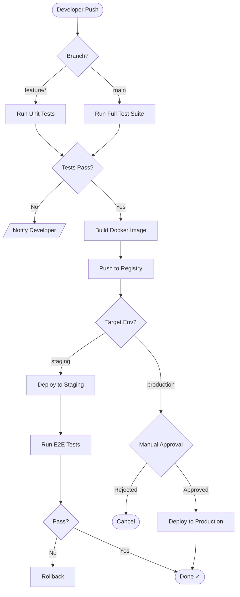
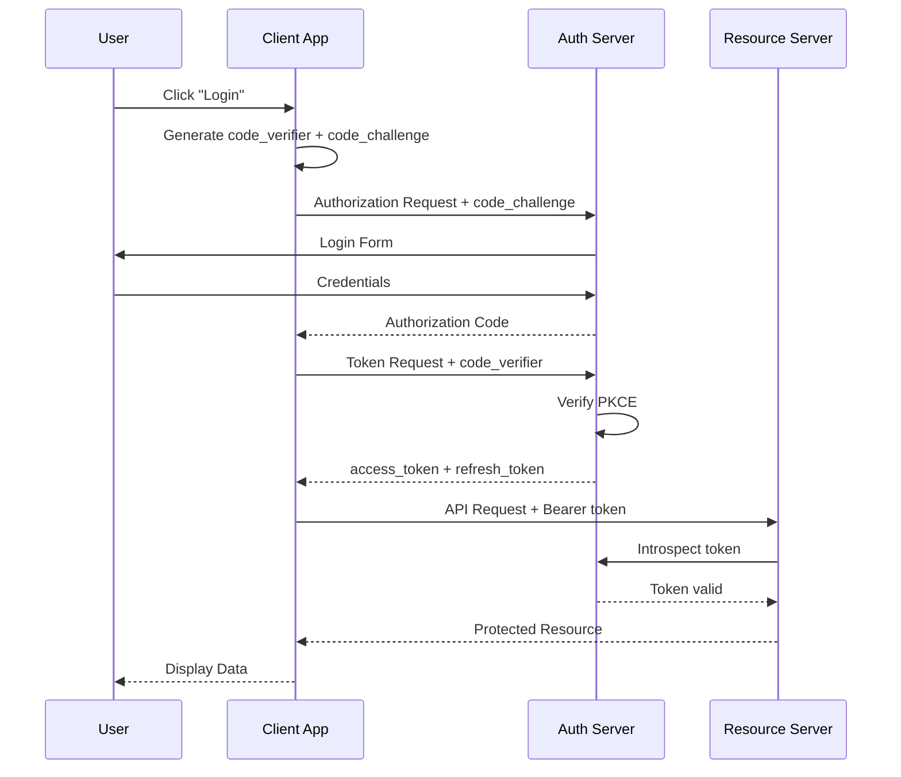
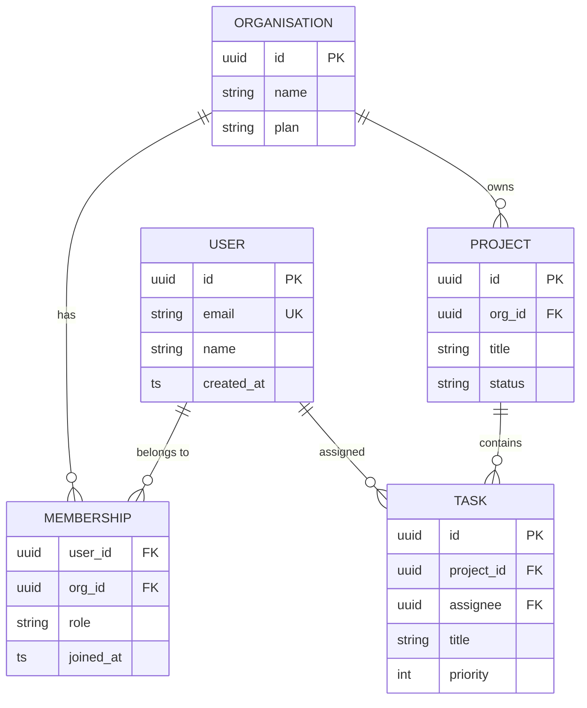
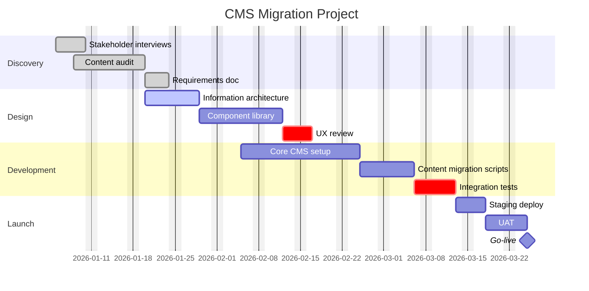

***

title: "CMS Feature Test: Nested & Complex Markdown"
description: "A comprehensive test document covering Hugo shortcodes, MDX components, and conventional Markdown features including deeply nested structures, tables, code blocks, admonitions, and more."
date: 2026-05-05
lastmod: 2026-05-05
draft: false
weight: 1
slug: cms-feature-test
authors:

* name: "Test Author"
  email: "<test@example.com>"
* name: "Second Author"
  url: "https://example.com"
  tags:
* markdown
* cms
* hugo
* mdx
* testing
  categories:
* QA
* Documentation
  series:
* CMS Testing
  toc: true
  math: true
  mermaid: true
  featured\_image: "/images/test-banner.jpg"
  images:
* "/images/og-test.png"
  aliases:
* /old-url/test
* /legacy/cms-test
  params:
  custom\_field: "custom\_value"
  nested\_param:
  level1: "value1"
  level2:
  deeper: true

***

\{/\* ============================================================
SECTION 0 — MDX IMPORTS (MDX environments only)
\============================================================ \*/}

import Callout from '@/components/Callout'
import Tabs, \{ Tab } from '@/components/Tabs'
import CodeSandbox from '@/components/CodeSandbox'
import DataTable from '@/components/DataTable'
import \{ Chart } from '@/components/Chart'
import Badge from '@/components/Badge'
import Accordion, \{ AccordionItem } from '@/components/Accordion'

\{/\* ============================================================
SECTION 1 — HEADING HIERARCHY
\============================================================ \*/}

# H1: Document Root — CMS Feature Test

## H2: Typography & Inline Formatting&#x20;

### H3: Basic Inline Elements

#### H4: Emphasis Variants

##### H5: Nested Emphasis

###### H6: Deepest Heading Level

Plain paragraph text. Lorem ipsum dolor sit amet, consectetur adipiscing elit.
Sed do eiusmod tempor incididunt ut labore et dolore magna aliqua.

**Bold text**, _italic text_, _**bold and italic**_, ~~strikethrough~~, `inline code`, <u>underlined via HTML</u>, <mark>highlighted via HTML</mark>, <kbd>Ctrl</kbd> + <kbd>C</kbd> keyboard shortcut,
<sup>superscript</sup>, <sub>subscript</sub>.

Hard line break (two trailing spaces):
This line follows a hard break.

Soft wrap continues on
the same paragraph.

***

### H3: Links & References

* [Absolute external link](https://www.example.com)
* [Relative internal link](/docs/getting-started)
* [Anchor link to heading](#h2-typography--inline-formatting)
* [Link with title](https://example.com)
* Auto-link: https://www.example.com
* Email auto-link: <test@example.com>
* Bare URL (renderer-dependent): https://www.example.com

Footnote reference in text. Another footnote.

[^1]: Short footnote definition.

[^long-note]: Long footnote that spans
    multiple lines with a code block inside:

    ```
    { "key": "value" }
    ```

    And a second paragraph.

***

## H2: Lists — All Variants

### H3: Unordered Lists (Nested 4 levels)

* Level 1 item A
  * Level 2 item A.1
    * Level 3 item A.1.a
      * Level 4 item A.1.a.i
      * Level 4 item A.1.a.ii — with `inline code`
    * Level 3 item A.1.b
  * Level 2 item A.2 — **bold**
* Level 1 item B
  * Level 2 item B.1
* Level 1 item C — plain

### H3: Ordered Lists (Nested, Mixed Styles)

1. First ordered item
   1. Sub-item 1.1
   2. Sub-item 1.2
      1. Sub-sub-item 1.2.1
      2. Sub-sub-item 1.2.2
         * Mixed unordered inside ordered
         * Another bullet
           1. Back to ordered at level 5
2. Second ordered item
3. Third ordered item — continues sequence after nested block

### H3: Task Lists (GitHub Flavored Markdown)

* [x] Completed task
* [ ] Incomplete task
* [x] Another done item
  * [x] Nested done sub-task
  * [ ] Nested pending sub-task
    * [ ] Deeply nested pending
* [ ] Top-level pending

### H3: Definition Lists (Pandoc / Extended Markdown)

Term Alpha
:   Definition of Alpha, first line.
Continuation of Alpha definition on second line.

Term Beta
:   First definition of Beta.
:   Second (alternative) definition of Beta — _italicised_.

Term with `code`:   A term whose label contains inline code.

***

## H2: Blockquotes — Nested & Complex

> Single-level blockquote. Lorem ipsum dolor sit amet.

> **Blockquote with formatting.**
>
> Second paragraph inside the blockquote.
>
> > Nested blockquote level 2.
> >
> > > Nested blockquote level 3 — _italic inside_.
> > >
> > > ```
> > > code block inside triple-nested blockquote
> > > ```
> >
> > Back to level 2.
>
> Back to level 1.
>
> * List inside blockquote
>   * Nested list inside blockquote
> * Another item

***

## H2: Code Blocks — Languages & Features

### H3: Fenced Code Blocks with Syntax Highlighting

```html
<!DOCTYPE html>
<html lang="en">
  <head>
    <meta charset="UTF-8" />
    <title>Test Page</title>
  </head>
  <body>
    <h1 className="hero">Hello, <span>World</span></h1>
  </body>
</html>
```

```css
:root {
  --color-primary: #3b82f6;
  --spacing-md: 1rem;
}

.container {
  display: grid;
  grid-template-columns: repeat(auto-fit, minmax(240px, 1fr));
  gap: var(--spacing-md);
}

@media (prefers-color-scheme: dark) {
  :root { --color-primary: #60a5fa; }
}
```

```javascript
// Async generator with error handling
async function* paginate(url, options = {}) {
  const { pageSize = 20, maxPages = Infinity } = options;
  let page = 1;

  while (page <= maxPages) {
    try {
      const res = await fetch(`${url}?page=${page}&size=${pageSize}`);
      if (!res.ok) throw new Error(`HTTP ${res.status}`);
      const { data, hasNext } = await res.json();
      yield data;
      if (!hasNext) break;
      page++;
    } catch (err) {
      console.error(`Pagination error at page ${page}:`, err);
      throw err;
    }
  }
}

// Usage
for await (const batch of paginate('/api/items', { pageSize: 50 })) {
  processBatch(batch);
}
```

```python
from dataclasses import dataclass, field
from typing import Generic, TypeVar, Iterator

T = TypeVar("T")

@dataclass
class TreeNode(Generic[T]):
    value: T
    children: list["TreeNode[T]"] = field(default_factory=list)

    def depth_first(self) -> Iterator["TreeNode[T]"]:
        """Yield nodes in depth-first order."""
        yield self
        for child in self.children:
            yield from child.depth_first()

    def __repr__(self) -> str:
        return f"TreeNode({self.value!r}, children={len(self.children)})"

# Build a sample tree
root = TreeNode("root", [
    TreeNode("a", [TreeNode("a1"), TreeNode("a2")]),
    TreeNode("b", [TreeNode("b1", [TreeNode("b1i")])]),
])

for node in root.depth_first():
    print(node)
```

```sql
-- Recursive CTE for org chart traversal
WITH RECURSIVE org_tree AS (
  -- Anchor: top-level employees
  SELECT
    id,
    name,
    manager_id,
    0          AS depth,
    CAST(name AS TEXT) AS path
  FROM employees
  WHERE manager_id IS NULL

  UNION ALL

  -- Recursive: direct reports
  SELECT
    e.id,
    e.name,
    e.manager_id,
    ot.depth + 1,
    ot.path || ' > ' || e.name
  FROM employees e
  INNER JOIN org_tree ot ON e.manager_id = ot.id
)
SELECT
  depth,
  REPEAT('  ', depth) || name AS display_name,
  path
FROM org_tree
ORDER BY path;
```

```bash
#!/usr/bin/env bash
# deploy.sh — zero-downtime rolling deploy

set -euo pipefail
IFS=$'\n\t'

readonly DEPLOY_DIR="/var/www/app"
readonly RELEASES_DIR="${DEPLOY_DIR}/releases"
readonly CURRENT_LINK="${DEPLOY_DIR}/current"
readonly TIMESTAMP=$(date +%Y%m%d%H%M%S)
readonly RELEASE_PATH="${RELEASES_DIR}/${TIMESTAMP}"

log() { echo "[$(date -Is)] $*" >&2; }
die() { log "ERROR: $*"; exit 1; }

[[ -d "${RELEASES_DIR}" ]] || mkdir -p "${RELEASES_DIR}"

log "Cloning release ${TIMESTAMP}..."
git clone --depth=1 --branch=main git@github.com:org/repo.git "${RELEASE_PATH}" \
  || die "Clone failed"

pushd "${RELEASE_PATH}" > /dev/null
  npm ci --omit=dev
  npm run build
popd > /dev/null

ln -sfn "${RELEASE_PATH}" "${CURRENT_LINK}"
log "Switched current → ${RELEASE_PATH}"

# Prune old releases (keep last 5)
ls -1dt "${RELEASES_DIR}"/*/  | tail -n +6 | xargs -r rm -rf
log "Deploy complete."
```

### H3: Indented Code Block (4 spaces)

```
This is an indented code block.
It does not get syntax highlighting.
Useful for plain-text output or legacy content.
    It can also be further indented.
```

### H3: Inline Code Edge Cases

Code with backtick: `` `nested backtick` ``Code with HTML: `<div className="foo">`Code with special chars: `$VAR && echo "ok" || exit 1`

***

## H2: Tables — Complex Structures

### H3: Basic Aligned Table

| Column Left    | Column Center | Column Right  |
| -------------- | ------------- | ------------- |
| Alpha          | Beta          | Gamma         |
| longer content | _italic cell_ | **bold cell** |
| `code cell`    | ​<br/>​       | 1,234.56      |
| multi `inline` | ~~strike~~    | ​<br/>​       |

### H3: Wide Reference Table — HTTP Status Codes

| Code | Name                  | Category     | Cacheable | Description                                            |
| ---- | --------------------- | ------------ | --------- | ------------------------------------------------------ |
| 200  | OK                    | 2xx Success  | ✅         | Request succeeded.                                     |
| 201  | Created               | 2xx Success  | ❌         | Resource was created; `Location` header points to it.  |
| 204  | No Content            | 2xx Success  | ❌         | Success with no response body.                         |
| 301  | Moved Permanently     | 3xx Redirect | ✅         | Permanent redirect; update bookmarks.                  |
| 304  | Not Modified          | 3xx Redirect | ✅         | Cached version is still valid.                         |
| 400  | Bad Request           | 4xx Client   | ❌         | Malformed syntax or invalid request message framing.   |
| 401  | Unauthorized          | 4xx Client   | ❌         | Authentication required or failed.                     |
| 403  | Forbidden             | 4xx Client   | ❌         | Authenticated but not authorised.                      |
| 404  | Not Found             | 4xx Client   | ✅         | Resource does not exist.                               |
| 429  | Too Many Requests     | 4xx Client   | ❌         | Rate limit exceeded; check `Retry-After` header.       |
| 500  | Internal Server Error | 5xx Server   | ❌         | Generic server-side failure.                           |
| 503  | Service Unavailable   | 5xx Server   | ❌         | Server temporarily overloaded or down for maintenance. |

### H3: Table Inside Blockquote

***

## H2: Images & Media

### H3: Standard Images


### H3: Image as Link

### H3: Reference-Style Image

### H3: HTML Image with Attributes

<figure>
  
  <figcaption>
    Figure 1 — An HTML <code>&lt;figure&gt;</code> + <code>&lt;figcaption&gt;</code> block,
    testing raw HTML passthrough inside Markdown.
  </figcaption>
</figure>

***

## H2: Hugo Shortcodes

### H3: Built-in Hugo Shortcodes

#### H4: Figure

\{\{\< figure
src="https://placehold.co/800x400/ef4444/ffffff?text=Hugo+Figure"
alt="Hugo figure shortcode test"
caption="Hugo `figure` shortcode with caption, link, and class attributes."
link="https://example.com"
class="featured-image"
width="800"
height="400"

> }}

#### H4: YouTube & Vimeo Embeds





#### H4: Highlight (with Options)


package main

import "fmt"

func fibonacci(n int) int \{
if n \<= 1 \{
return n
}
return fibonacci(n-1) + fibonacci(n-2)
}

func main() \{
for i := 0; i \< 10; i++ \{
fmt.Printf("fib(%d) = %d\n", i, fibonacci(i))
}
}


#### H4: Gist



#### H4: Tweet / X Post



#### H4: Instagram



#### H4: Ref & RelRef

See the \[getting started guide]\() for setup.

Related: \[Configuration]\()

### H3: Custom Hugo Shortcodes

#### H4: Callout / Admonition Variants


This is a **note** callout. It contains _formatted_ text and `inline code`.



This is a **warning** callout. Be careful:

* Check your config before deploying
* Back up your data

```bash
cp -r ./data ./data.bak
```



Irreversible action ahead. This **cannot be undone**.



Use `Ctrl+Shift+P` to open the command palette.



Version `2.4.0` introduced breaking changes to the config schema.


#### H4: Tabs Shortcode



```javascript
const greet = name => `Hello, ${name}!`;
console.log(greet("World"));
```



```python
greet = lambda name: f"Hello, {name}!"
print(greet("World"))
```



```go
package main
import "fmt"
func main() { fmt.Printf("Hello, %s!\n", "World") }
```



```rust
fn main() {
    println!("Hello, {}!", "World");
}
```



#### H4: Details / Spoiler


Hidden content revealed on click. Useful for:

1. Long code samples
2. Spoilers
3. Optional deep-dives

```json
{
  "revealed": true,
  "nested": {
    "data": [1, 2, 3]
  }
}
```


#### H4: Code with Filename


default: \&default
adapter: postgresql
encoding: unicode
pool: \<%= ENV.fetch("RAILS\_MAX\_THREADS") \{ 5 } %>

development:
\<\<: \*default
database: myapp\_development

test:
\<\<: \*default
database: myapp\_test

production:
\<\<: \*default
database: myapp\_production
username: \<%= ENV\["DATABASE\_USERNAME"] %>
password: \<%= ENV\["DATABASE\_PASSWORD"] %>
host:     \<%= ENV\["DATABASE\_HOST"] %>


#### H4: Param Shortcode

Site title: ​

#### H4: Shortcode Inside Blockquote (Edge Case)

> 
> A shortcode rendered inside a Markdown blockquote.
> 

***

## H2: MDX Components

### H3: Callout Component (MDX)

<Callout type="warning" title="Breaking Change in v3">
The `config.toml` format has been **deprecated**. Migrate to `config.yaml` before upgrading.

```diff
- baseURL = "https://example.com"
- languageCode = "en-us"
+ baseURL: "https://example.com"
+ languageCode: "en-us"
```
</Callout>
<Callout type="success">
Deployment succeeded. No action required.
</Callout>

### H3: Tabs Component (MDX)

<Tabs defaultValue="npm">
<Tab value="npm" label="npm">
````bash
    npm install @example/sdk
    npm run build
    ```
````
</Tab>
<Tab value="yarn" label="Yarn">
````bash
    yarn add @example/sdk
    yarn build
    ```
````
</Tab>
<Tab value="pnpm" label="pnpm">
````bash
    pnpm add @example/sdk
    pnpm build
    ```
````
</Tab>
<Tab value="bun" label="Bun">
````bash
    bun add @example/sdk
    bun run build
    ```
````
</Tab>
</Tabs>

### H3: Badge / Chip Component

Status: <Badge variant="success">Stable</Badge>Version: <Badge variant="info">v2.4.1</Badge>Deprecation: <Badge variant="warning">Deprecated</Badge>Removal: <Badge variant="danger">Removed in v4</Badge>​

### H3: Accordion (MDX)

<Accordion/>
<AccordionItem title="What is MDX?">
```
MDX is a format that lets you write **JSX in your Markdown documents**.
You can import and use React components like this:
```

````
```mdx
import Button from './Button'

# Hello

<Button>Click me</Button>
```
````
</AccordionItem>
<AccordionItem title="When should I use Hugo shortcodes vs MDX?">
```
| Criterion         | Hugo Shortcodes | MDX              |
| :---------------- | :-------------- | :--------------- |
| Runtime           | Build-time Go   | JS (React/Next)  |
| Component logic   | Limited         | Full React       |
| Type safety       | None            | TypeScript       |
| Ecosystem         | Hugo-only       | npm / React      |
```
</AccordionItem>
<AccordionItem title="Nested accordion — third level stress test"/>
<Accordion/>
<AccordionItem title="Deeply nested item">
```
    Content inside a nested `
```

<Accordion/>

`inside another`

<Accordion/>

\`.
This tests recursive component rendering.

```
    - Bullet A
    - Bullet B
      - Sub-bullet B.1
  </AccordionItem>
</Accordion>
```
</AccordionItem>

### H3: DataTable Component (MDX with Props)

### H3: Chart Component (MDX)

### H3: Mixing MDX and Markdown

<Callout type="info" title="Context">
The table below shows feature parity between renderers.
</Callout>

| Feature              | CommonMark | GFM | Hugo | MDX |
| -------------------- | ---------- | --- | ---- | --- |
| Tables               | ❌          | ✅   | ✅    | ✅   |
| Task lists           | ❌          | ✅   | ✅    | ✅   |
| Footnotes            | ❌          | ✅   | ✅    | ✅   |
| Definition lists     | ❌          | ❌   | ✅    | ✅   |
| Custom components    | ❌          | ❌   | 🟡   | ✅   |
| JSX expressions      | ❌          | ❌   | ❌    | ✅   |
| Math (KaTeX/MathJax) | ❌          | ❌   | ✅    | ✅   |
| Mermaid diagrams     | ❌          | ✅   | ✅    | ✅   |

<Callout type="tip">
🟡 = partial support via shortcodes only.
</Callout>

***

## H2: Mathematical Notation (KaTeX / MathJax)

### H3: Inline Math

The quadratic formula is $x = \frac{-b \pm \sqrt{b^2 - 4ac}}{2a}$.

Euler's identity: $e^{i\pi} + 1 = 0$.

The probability density: $f(x) = \frac{1}{\sigma\sqrt{2\pi}} e^{-\frac{1}{2}\left(\frac{x-\mu}{\sigma}\right)^2}$.

### H3: Display / Block Math

$$
\nabla \cdot \mathbf{E} = \frac{\rho}{\varepsilon_0}
\qquad
\nabla \cdot \mathbf{B} = 0
\qquad
\nabla \times \mathbf{E} = -\frac{\partial \mathbf{B}}{\partial t}
\qquad
\nabla \times \mathbf{B} = \mu_0\!\left(\mathbf{J} + \varepsilon_0\frac{\partial \mathbf{E}}{\partial t}\right)
$$

$$
\sum_{k=0}^{n} \binom{n}{k} x^k y^{n-k} = (x + y)^n
$$

$$
\int_{-\infty}^{\infty} e^{-x^2} \, dx = \sqrt{\pi}
$$

### H3: Matrix

$$
\mathbf{A} =
\begin{pmatrix}
  a_{11} & a_{12} & \cdots & a_{1n} \\
  a_{21} & a_{22} & \cdots & a_{2n} \\
  \vdots & \vdots & \ddots & \vdots \\
  a_{m1} & a_{m2} & \cdots & a_{mn}
\end{pmatrix}
$$

***

## H2: Mermaid Diagrams

### H3: Flowchart — CI/CD Pipeline



### H3: Sequence Diagram — OAuth2 PKCE Flow



### H3: Entity Relationship Diagram



### H3: Gantt Chart



***

## H2: Raw HTML Blocks

### H3: Details / Summary (Native HTML)

<details>
  <summary><strong>Click to expand — native HTML details</strong></summary>

  <p>This uses native HTML <code>&lt;details&gt;</code> and <code>&lt;summary&gt;</code> without any shortcode.</p>

  <ul>
    <li>Works in most Markdown renderers that allow HTML passthrough</li>
    <li>No JavaScript required</li>
  </ul>

  <pre><code>// Code inside a details block
const x = 42;</code></pre>

</details>

### H3: HTML Table (Complex)

<table>
  <caption>Table Caption — HTML Native Table</caption>
  <colgroup>
    <col style="width: 30%;" />
    <col style="width: 40%;" />
    <col style="width: 30%;" />
  </colgroup>
  <thead>
    <tr>
      <th scope="col">Feature</th>
      <th scope="col">Description</th>
      <th scope="col">Support</th>
    </tr>
  </thead>
  <tbody>
    <tr>
      <td rowspan="2"><strong>Shortcodes</strong></td>
      <td>Hugo built-in shortcodes</td>
      <td>✅ Full</td>
    </tr>
    <tr>
      <td>Custom shortcodes</td>
      <td>✅ Full</td>
    </tr>
    <tr>
      <td><strong>MDX</strong></td>
      <td colspan="2" style="text-align:center;">React/Next.js only — not Hugo</td>
    </tr>
  </tbody>
  <tfoot>
    <tr>
      <td colspan="3"><em>Table last updated: 2026-05-05</em></td>
    </tr>
  </tfoot>
</table>

### H3: Inline HTML Mixed with Markdown

<div className="custom-container highlight-box">

**This block mixes HTML wrapper with Markdown content inside.**

* Markdown lists work here
* If the renderer supports it

</div>

***

## H2: Edge Cases & Stress Tests

### H3: Escape Characters

\*not italic\* \`not code\` \[not a link] # not a heading
Literal backslash: \ — Literal pipe: |

### H3: Special Characters in Code

`<script>alert('xss')</script>`\
`SELECT * FROM users WHERE id = '1' OR '1'='1'`\
`{{ template "partial" . }}`\
`{}`

### H3: Long Unbroken String

```
```

### H3: Unicode, Emoji & RTL

* Emoji: 🚀 🎨 📦 ✅ ❌ ⚠️ 💡 🔥
* CJK: 你好世界 — 日本語テスト — 한국어 테스트
* Arabic (RTL): <span dir="rtl">مرحبا بالعالم</span>
* Hebrew (RTL): <span dir="rtl">שלום עולם</span>
* Accented: café, naïve, über, résumé, señor, Ångström

### H3: Nested Shortcode + MDX + Markdown (Triple Stress)

<Callout type="warning" title="Nested Everything">

A Hugo shortcode nested inside an MDX component.


> Blockquote inside MDX inside Hugo shortcode context.
>
> ```javascript
> // Code inside blockquote inside MDX
> const stress = "maximum";
> ```

| Column A | Column B |
| -------- | -------- |
| Table    | Inside   |
| MDX      | Block    |
</Callout>

### H3: Empty & Near-Empty Structures

Empty blockquote:

> ​

Empty table cell:

| A | B | C |
| - | - | - |
| ​ | x | ​ |

Zero-width content: ​ (zero-width space between these colons) :​:

### H3: Deeply Nested Ordered List (6 levels)

1. L1
   1. L2
      1. L3
         1. L4
            1. L5
               1. L6 — deepest level
               2. L6 second item
            2. L5 second item
         2. L4 second item
      2. L3 second item
   2. L2 second item
2. L1 second item

***

## H2: Front Matter Variable Interpolation

> **Note for CMS developers:** The values below should resolve from the front matter defined at the top of this document.

* Page title (Hugo): `{{ .Title }}`
* Page description: `{{ .Description }}`
* Page date: `{{ .Date.Format "2006-01-02" }}`
* Reading time: `{{ .ReadingTime }} min`
* Word count: `{{ .WordCount }}`
* Tags: `{{ range .Params.tags }}{{ . }} {{ end }}`
* Custom param: `{{ .Params.custom_field }}`
* Nested param: `{{ .Params.nested_param.level2.deeper }}`

MDX variable interpolation:

export const version = "2.4.1"
export const releaseDate = new Date("2026-05-05").toLocaleDateString()

Current version: **\{version}** — Released: _\{releaseDate}_

***

## H2: Horizontal Rules (Multiple Styles)

With hyphens:

***

With asterisks:

***

With underscores:

***

***

## H2: Metadata & SEO Shortcodes

\{\{\< seo
title="CMS Feature Test"
description="Comprehensive Markdown test document"
canonical="https://example.com/cms-feature-test"
og\_image="/images/og-test.png"

\{\{\< schema type="Article"
headline="CMS Feature Test"
author="Test Author"
datePublished="2026-05-05"}}

***

## H2: Related Content & Navigation Shortcodes







***

_Document ends. Total sections tested: headings (6 levels), inline formatting, links, footnotes, ordered/unordered/task/definition lists, blockquotes (nested 3 deep), code blocks (7 languages + indented), tables (aligned, wide, in blockquote, HTML), images (inline, linked, reference, HTML figure), Hugo shortcodes (figure, youtube, vimeo, highlight, gist, tweet, instagram, ref/relref, callout, tabs, details, code-file, param, seo, schema, related, prev-next, breadcrumbs), MDX components (Callout, Tabs, Badge, Accordion, DataTable, Chart), math (inline + block + matrix), Mermaid (flowchart, sequence, ERD, Gantt), raw HTML (details, table, RTL), and edge cases (escapes, unicode, deeply nested, empty structures)._
